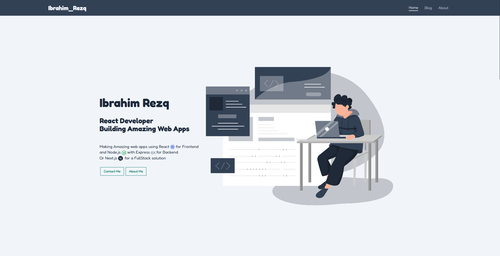

# Portfolio

A personal portfolio website built with **Next.js** and **TypeScript**.  
This project was created as a learning exercise to practice building a modern web application with React framework Next.js, TypeScript type safety, and deployment with Vercel.

***

## 🌐 Live Demo
[View the live site](https://game-dev-rose.vercel.app)

***

## 🖼️ Preview


## 🎯 Purpose
This project was developed to practice:  
- Building a dynamic React app using Next.js  
- Using TypeScript to enhance code quality  
- Responsive UI design with CSS modules  
- Deploying web apps on Vercel  

The portfolio showcases my projects and skills while serving as an online professional profile.

***

## 💡 Learning Takeaways
Through this project, I learned to:  
- Configure Next.js features like routing and API routes  
- Implement TypeScript for better development experience  
- Use CSS Modules for scoped styling  
- Optimize images and assets for web performance  
- Deploy Next.js apps seamlessly on Vercel  

***

## 🧩 Technologies Used
- **Next.js**  
- **TypeScript**  
- **React**  
- **CSS Modules**  
- **Vercel (hosting)**  

***

## 🚀 Getting Started

1. Clone the repository:  
   ```bash
   git clone https://github.com/Ibrahim-Rezq/portfolio.git
   ```

2. Install dependencies:  
   ```bash
   npm install
   # or
   yarn
   ```

3. Run the development server:  
   ```bash
   npm run dev
   # or
   yarn dev
   ```

4. Open [http://localhost:3000](http://localhost:3000) to see the result.

***

## ⚙️ Customization

Feel free to modify this portfolio:  
* Update `pages/index.tsx` to add or change projects  
* Customize styling in CSS Modules under `styles/`  
* Add new API routes in `pages/api` if needed  
* Change assets like images and icons in the `public/` folder  

***

## ⚖️ License

This project is shared under the **MIT License** — you are free to use, modify, and distribute it for personal or commercial projects.

***

## 👨‍💻 Author

Created by [Ibrahim Rezq](https://github.com/Ibrahim-Rezq) as part of my web development learning journey.
