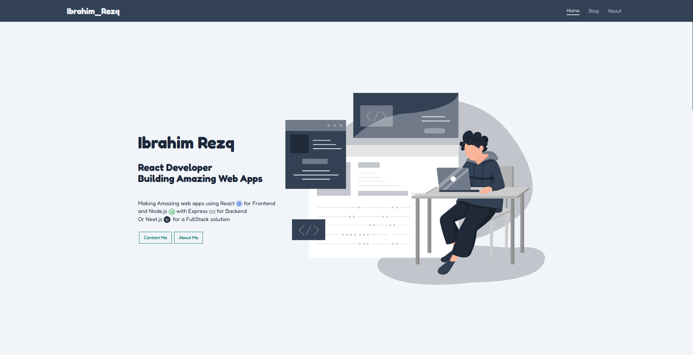

# Portfolio

My first real portfolio site, built in 2022 while learning Next.js and TypeScript. The current one lives in [next-portfolio-updated](https://github.com/Ibrahim-Rezq/next-portfolio-updated). This repo stays up as a record of where I started.



The old deployment is gone. The React version aged out of what Vercel supports, so local is the only way to run it now. That's fine for what this repo is.

## What I was practicing

Routing and API routes in Next.js, TypeScript instead of plain JavaScript, scoped styling with CSS Modules, and getting a deploy to work on Vercel for the first time.

## Running it

```bash
git clone https://github.com/Ibrahim-Rezq/portfolio.git
cd portfolio
npm install
npm run dev
```

Open [http://localhost:3000](http://localhost:3000).

## Stack

Next.js, TypeScript, React, CSS Modules.
